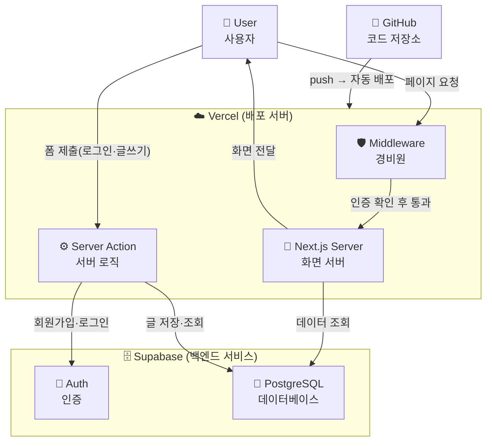
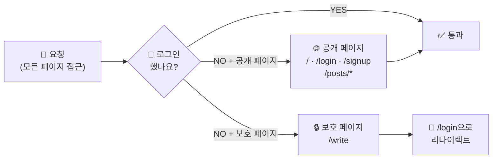
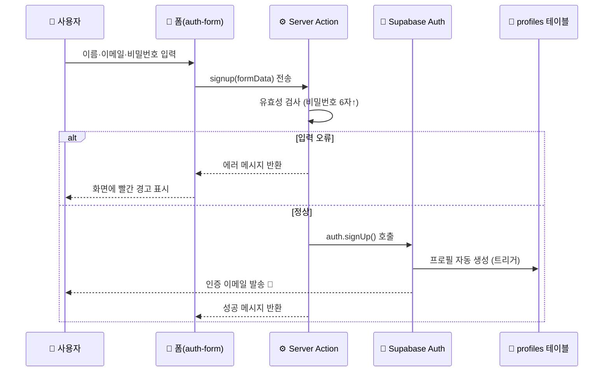
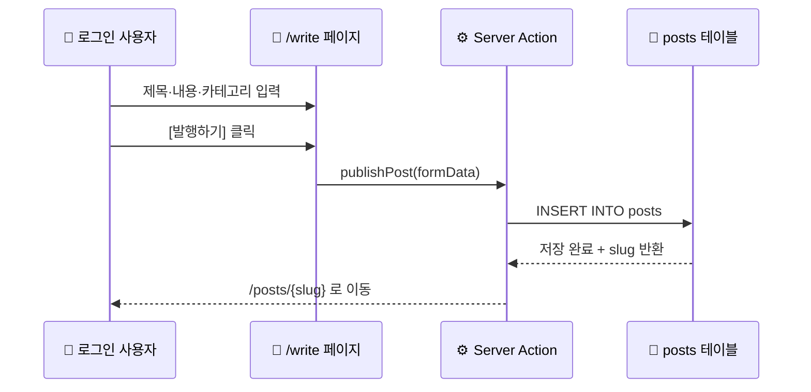
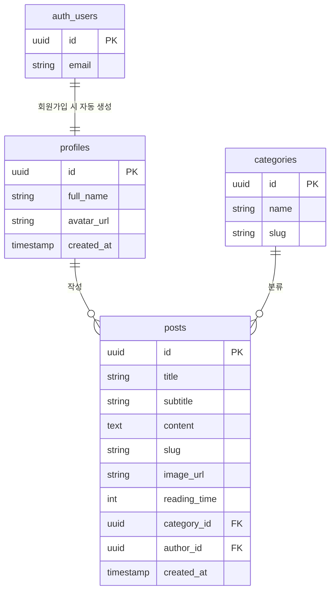
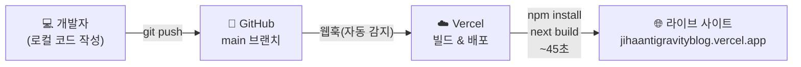

# 📐 antigravityblog 기술 아키텍처

---

## 1. 전체 시스템 구조 (System Architecture)

| 그림 용어 | 한글 의미 | 쉽게 말하면 |
|---|---|---|
| User | 사용자 | 블로그를 보는 사람 |
| Middleware | 미들웨어 | 모든 방문자를 먼저 확인하는 경비원 |
| Next.js Server | 서버 | 화면을 만들어서 사용자에게 보내주는 주방 |
| Server Action | 서버 액션 | 폼 제출 시 서버에서 직접 실행되는 로직 |
| Auth | 인증 | "당신이 누구인지" 확인하는 시스템 |
| PostgreSQL | 데이터베이스 | 글·사용자 정보가 저장되는 서랍장 |
| GitHub | 깃허브 | 코드 레시피를 보관하는 창고 |
| Vercel | 버셀 | 창고(GitHub)에서 레시피 받아 실제 서비스 운영 |

---

## 2. 미들웨어 흐름 (Middleware Flow)

| 그림 용어 | 한글 의미 | 쉽게 말하면 |
|---|---|---|
| 요청 | Request | 사용자가 주소창에 URL 입력하는 행위 |
| 로그인 확인 | Auth Check | 쿠키에 세션이 있는지 검사 |
| 공개 페이지 | Public Page | 로그인 없이 누구나 볼 수 있는 페이지 |
| 보호 페이지 | Protected Page | 로그인해야만 접근 가능한 페이지 |
| 리다이렉트 | Redirect | 자동으로 다른 페이지로 이동시키기 |

---

## 3. 회원가입 흐름 (Signup Flow)

| 그림 용어 | 한글 의미 | 쉽게 말하면 |
|---|---|---|
| auth-form | 인증 폼 | 사용자가 입력하는 회원가입 화면 |
| Server Action | 서버 액션 | 입력값을 받아 처리하는 서버 코드 |
| 유효성 검사 | Validation | 입력값이 올바른지 검사 (빈칸? 짧은 비밀번호?) |
| auth.signUp() | 회원가입 함수 | Supabase에 새 계정 생성 요청 |
| 트리거 | Trigger | 회원가입 완료 시 자동으로 실행되는 DB 규칙 |
| 인증 이메일 | Confirm Email | "이 이메일이 본인 것이 맞나요?" 확인 메일 |

---

## 4. 글 작성 흐름 (Write Post Flow)

| 그림 용어 | 한글 의미 | 쉽게 말하면 |
|---|---|---|
| /write 페이지 | 글쓰기 페이지 | Markdown 에디터가 있는 글 작성 화면 |
| publishPost() | 발행 함수 | "이 글을 DB에 저장해줘"라는 명령 |
| INSERT INTO posts | DB 삽입 | 새 글 데이터를 테이블에 추가 |
| slug | 슬러그 | 글의 고유 URL 주소 (예: `my-first-post`) |
| Markdown | 마크다운 | `**굵게**`, `# 제목` 같은 문서 작성 언어 |

---

## 5. 데이터베이스 구조 (DB Schema)

| 그림 용어 | 한글 의미 | 쉽게 말하면 |
|---|---|---|
| auth_users | 사용자 계정 | Supabase가 관리하는 로그인 정보 |
| profiles | 프로필 | 이름·아바타 등 사용자 공개 정보 |
| categories | 카테고리 | 글 분류 (CSS, JavaScript 등) |
| posts | 게시글 | 실제 블로그 글 데이터 |
| PK (Primary Key) | 기본 키 | 각 데이터를 구별하는 고유 번호 |
| FK (Foreign Key) | 외래 키 | 다른 테이블과 연결하는 참조값 |
| RLS | 행 수준 보안 | "내 글은 내가 쓰고, 읽기는 모두 가능"한 보안 규칙 |

---

## 6. 배포 파이프라인 (CI/CD)

| 그림 용어 | 한글 의미 | 쉽게 말하면 |
|---|---|---|
| git push | 코드 업로드 | 내 컴퓨터 코드를 GitHub에 올리기 |
| 웹훅(Webhook) | 자동 알림 | GitHub이 Vercel에 "새 코드 왔어요!" 신호 보내기 |
| npm install | 의존성 설치 | 프로젝트에 필요한 패키지 다운로드 |
| next build | 빌드 | 코드를 실제로 실행 가능한 파일로 변환 |
| CI/CD | 지속적 통합·배포 | 코드 올리면 자동으로 서비스 업데이트되는 시스템 |
